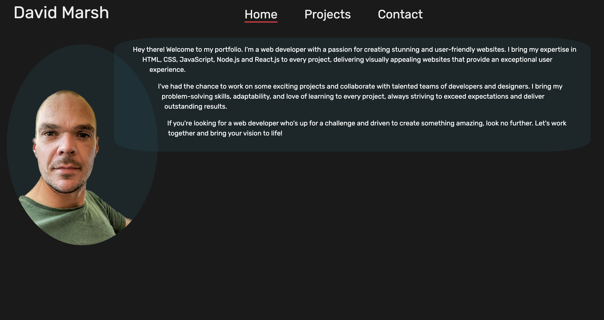

# React-Portfolio

[Link to the live site](https://thunderous-platypus-04d6fa.netlify.app)

## Description

A portfolio website designed and developed by me to show the projects I've been working on. This site includes a list of projects, a page containing my CV and links to my GitHub and LinkedIn profiles.

## Screenshot

## Technologies Used

For this site I used React to create the front-end UI. I used Bootstrap, as well as some custom CSS for the styling.

I used React-PDF to display my CV and React-Router-Dom for routing.

For this project I used Netlify to host the site.

## Credits

Background photo by <a href="https://unsplash.com/@jeremybishop?utm_source=unsplash&utm_medium=referral&utm_content=creditCopyText">Jeremy Bishop</a> on <a href="https://unsplash.com/backgrounds?utm_source=unsplash&utm_medium=referral&utm_content=creditCopyText">Unsplash</a>
  